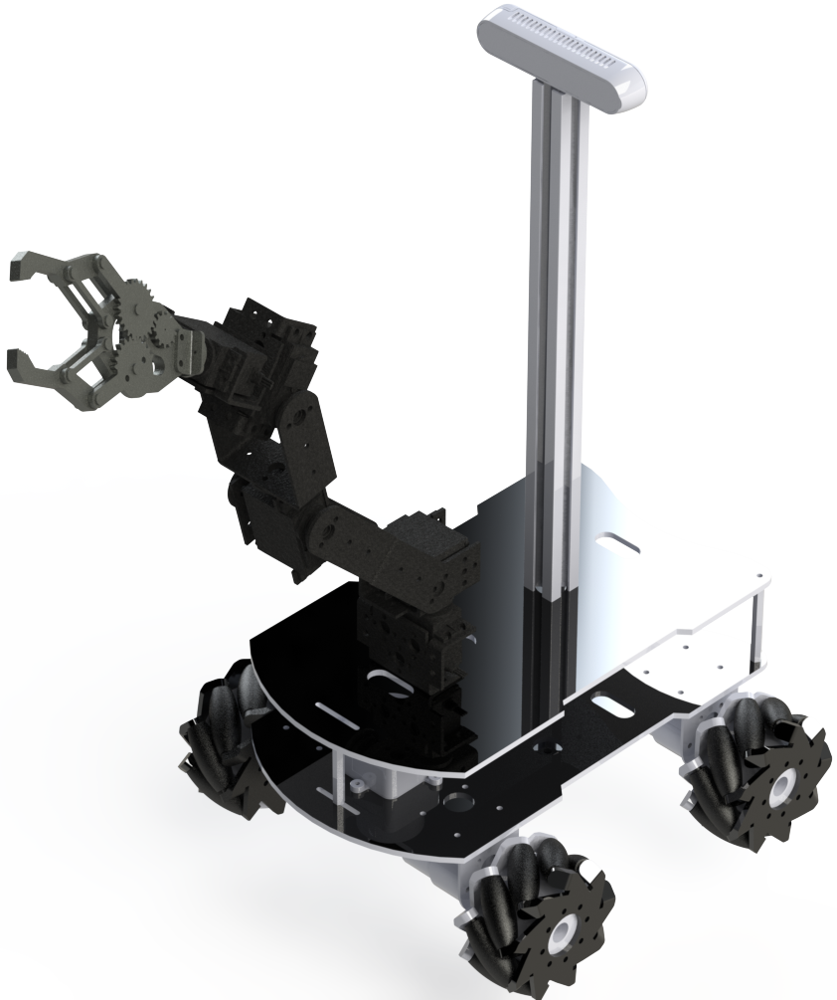

# Omnidirectional Manipulator Robot using ROS2

Omnidirectional Manipulator Robot using ROS2 and MicroROS.



## Table of Contents
- [Omnidirectional Manipulator Robot using ROS2](#omnidirectional-manipulator-robot-using-ros2)
  - [Table of Contents](#table-of-contents)
  - [Hardware Requirements](#hardware-requirements)
  - [Software Requirements](#software-requirements)
  - [Installation](#installation)
  - [Controller Setup](#controller-setup)

## Hardware Requirements
- ESP32.
- Four encoder motors.
- L293D.
- Xbox Controller.
- 18650 batteries.
- Raspberry Pi 5 (4gb RAM).
- Arduino Mega 2560.
- Six MG995 servomotors.

## Software Requirements
In order for the project to work we need to have installed [Ubuntu 24.04 LTS Noble Numbat](https://releases.ubuntu.com/noble/) alocated
in a partition with a Windows dual boot or as the main Operating System of your machine. 

You can try to virtualize it but in my experience, networking and driver problems arouse.

## Installation
We need to install [ROS Jazzy](https://wiki.ros.org/jazzy), you can follow the [documentation](https://wiki.ros.org/jazzy/Installation/Ubuntu) on how to install it or you can follow and run these few commands inside Ubuntu's terminal:

```shell
sudo sh -c 'echo "deb http://packages.ros.org/ros/ubuntu $(lsb_release -sc) main" > /etc/apt/sources.list.d/ros-latest.list'
```

```shell
sudo apt install curl
curl -s https://raw.githubusercontent.com/ros/rosdistro/master/ros.asc | sudo apt-key add -
```

```shell
sudo apt update
sudo apt install ros-jazzy-desktop-full
echo "source /opt/ros/jazzy/setup.bash" >> ~/.bashrc
source ~/.bashrc
```

## Controller Setup
You can use any controller listed in the [documentation](http://wiki.ros.org/joy). I'm personally
using an 8bitdo Ultimate C 2.4GHz. It is not a Xbox Controller per se but I managed to find some drivers to 
trick Linux into thinking it is a generic Xbox Controller ([you can find the post here](https://gist.github.com/ammuench/0dcf14faf4e3b000020992612a2711e2)):

```shell
touch /etc/udev/rules.d/99-8bitdo-xinput.rules
sudo nano /etc/udev/rules.d/99-8bitdo-xinput.rules
```
Inside 99-8bitdo-xinput.rules you type the following and save:
```shell
ACTION=="add", ATTRS{idVendor}=="2dc8", ATTRS{idProduct}=="3106", RUN+="/sbin/modprobe xpad", RUN+="/bin/sh -c 'echo 2dc8 3106 > /sys/bus/usb/drivers/xpad/new_id'"
```

Reload udevadm service
```shell
sudo udevadm control --reload
```

You also need to make your [joystick device accesible](http://wiki.ros.org/joy/Tutorials/ConfiguringALinuxJoystick):

```shell
ls -l /dev/input/jsX
```

You will see something similar to:
```shell
crw-rw-XX- 1 root dialout 188, 0 2009-08-14 12:04 /dev/input/jsX
```

We need to change XX to rw:
```shell
sudo chmod a+rw /dev/input/jsX
```